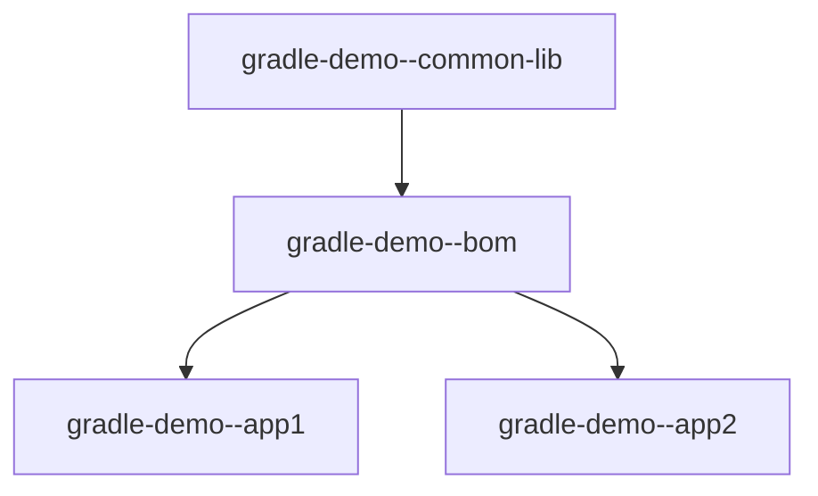

# Gradle-demo 
___
Welcome to Gradle-Demo, a multi-module Gradle project showcasing various subprojects. This project is structured into three submodules:

### 1. gradle-demo--bom 
   The `gradle-demo--bom` (Bill of Materials) submodule serves as a central place to manage and version dependencies for the entire Gradle-Demo project. It ensures consistent dependency versions across different modules.

### 2. gradle-demo--common
   The `gradle-demo--common` submodule is a sample common library project. It provides reusable components and functionalities that can be shared among other modules within the Gradle-Demo project.

### 3. gradle-demo--app
   The `gradle-demo--app` submodule is a web application showcasing the usage of the common library and any additional features. It represents a practical implementation of the shared components from the gradle-demo--common module.

## Project Structure
___

|  Gradle-Demo |  
|----------------|
|-- gradle-demo--bom |  
|-- gradle-demo--common|  
|-- gradle-demo--app|

## Module Details
___

1. gradle-demo--bom  - Centralized management of dependencies.

2. gradle-demo--common - Shared common library project.

3. gradle-demo--app - Web application module utilizing common library.

## Project Diagram
___

The diagram illustrates the dependency flow, with the `gradle-demo--bom` module providing dependency management for both `gradle-demo--common` and `gradle-demo--app` modules.

Feel free to explore each submodule for more details on their respective functionalities and configurations. Happy coding!